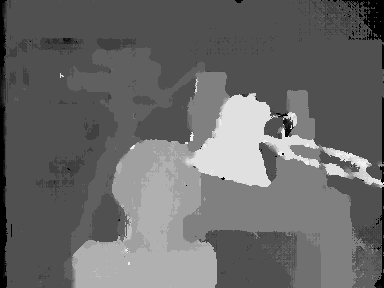
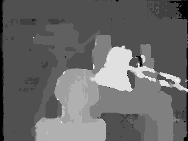
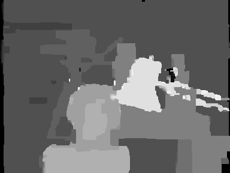
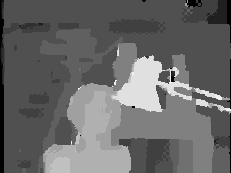

# Stereo Matching Algorithms
Optimized (very fast) stereo matching algorithms in MATLAB.

It includes:
- Dynamic Programming (2 different versions)
- Semi-Global Matching
- Semi-Global Block Matching
- Belief Propagation (3 different versions)

For an optimized version of Block Matching algorithm, look at here: [Block Matching for Stereo Matching](https://github.com/aposb/block-matching-for-stereo)

## Input Image
The Tsukuba stereo image that used as input.

   

## Output Image
The disparity map that created at the output using the Dynamic Programming (Left-Right Axes) algorithm.

   

The disparity map that created at the output using the Dynamic Programming (Left-Disparity Axes) algorithm.

   

The disparity map that created at the output using the Semi-Global Matching algorithm.

   

The disparity map that created at the output using the Semi-Global Block Matching algorithm.

   

The disparity map that created at the output using the Belief Propagation (Accelerated) algorithm.

   

The disparity map that created at the output using the Belief Propagation (Synchronous) algorithm.

   

## Related Repositories

- [Stereo Matching using Dynamic Programming (Left-Right Axes)](https://github.com/bollasap/stereo-matching-using-dynamic-programming-left-right)
- [Stereo Matching using Dynamic Programming (Left-Disparity Axes)](https://github.com/bollasap/stereo-matching-using-dynamic-programming-left-disparity)
- [Semi-Global Matching](https://github.com/bollasap/semi-global-matching)
- [Semi-Global Block Matching](https://github.com/bollasap/semi-global-block-matching)
- [Stereo Matching using Belief Propagation (Accelerated)](https://github.com/bollasap/stereo-matching-using-belief-propagation-accelerated)
- [Stereo Matching using Belief Propagation (Synchronous)](https://github.com/bollasap/stereo-matching-using-belief-propagation-synchronous)
- [Stereo Matching using Belief Propagation (Synchronous) - a different aproach](https://github.com/aposb/stereo-matching-using-belief-propagation-fast)
